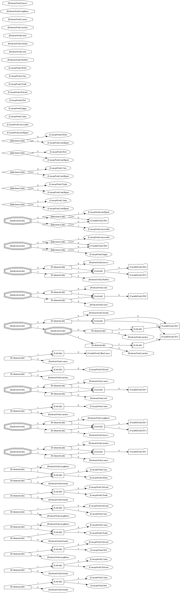
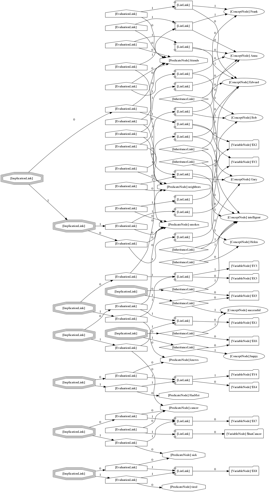

## Summary

These are visualizations of the "smokes" PLN/attention allocation example located [here](https://github.com/opencog/opencog/blob/master/opencog/python/pln/examples/tuffy/smokes/smokes.scm) with extra confounding data to test the inference control mechanism.

For visualizations of the basic data without the extra data, see the examples in the ***smokes*** subdirectory.

## Examples

### Create duplicate copies of ConceptNodes and PredicateNodes

### Raw version without any duplicate copies

