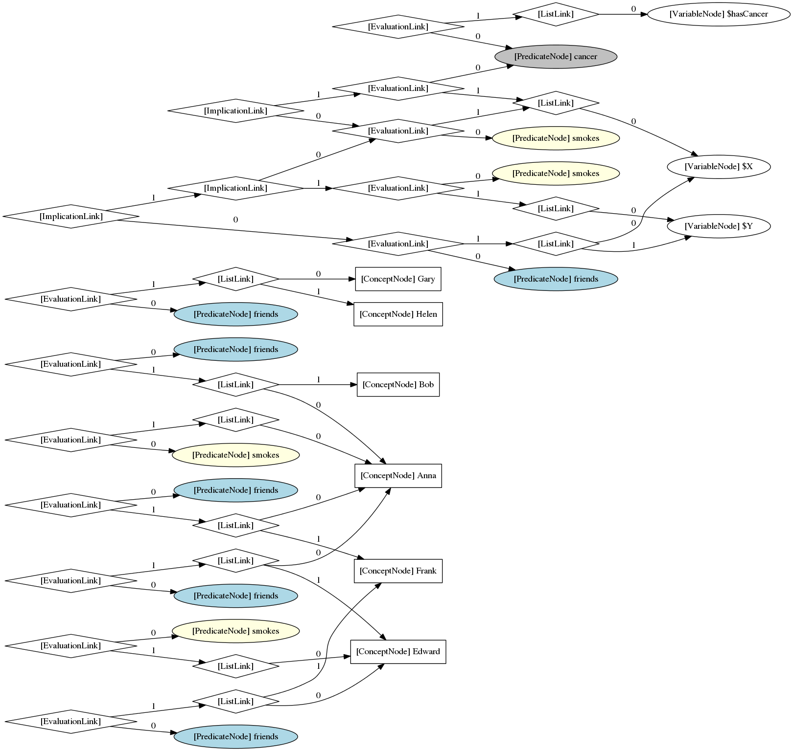

## Summary

**This is a demonstration of various methods of simplifying visualization of an OpenCog hypergraph by using duplication of certain vertex types to reduce tangling of edges on highly connected vertices along with color coding to indicate commonality among duplicate vertices.**

Compare the first three processed graphs to the unprocessed graph at the end.

These are visualizations of the "smokes" PLN/attention allocation example located [here](https://github.com/opencog/opencog/blob/master/opencog/python/pln/examples/tuffy/smokes/smokes.scm).

## Examples

### Create duplicate copies of ConceptNodes and PredicateNodes
*Duplicate nodes share a common coloring.*

### Pivot on PredicateNodes by creating duplicate copies of ConceptNodes
*Duplicate nodes share a common coloring.*

### Pivot on ConceptNodes by creating duplicate copies of PredicateNodes
*Duplicate nodes share a common coloring.*

### Raw version without any duplicate copies

